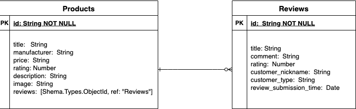

# BuyBest (Full-Stack MERN Project)

#### By: Jane Mingzhen Wang

#### Date: 12/15/2021 at 12:00pm EST

---

---

## Overview

**This project is to build a full-stack (Mongoose/Express/React/Node) application with a functioning backend and frontend.**
 

- The backend sever is a MongoDB with Mongoose/Express which is document-orented and offers a faster query procss. It is used as a complementary data storage to transaction SQL databases for retail stores. The information of products and reviews can be pull into MongoDB from the main SQL databases in retail stores.
- The frondend website is implemented with React/Node as a single page application(SPA). Customers are allowed to interact with web pages, make _requests_(search, login, sign up and input reviews) to get products and get(view)/post/update/delete reviews to the backend server.   
  In this project, I will use Faker package creating the information of products and reviews to show the process. Later will use API call from [SerpApi](https://serpapi.com/) to get the data from a retail store, like Home Depot or WalMart and write into the MongoDB.

---

## Getting Started

- Create a [new repo](https://github.com/janemzwangnj/buybest)
- Write a readme.md
- Draw ERD and Components Hierarchy Diagram
- Create a [Trello](https://trello.com/b/syd8w36y/buybest)

---

## ERD for the backend

---

## Component Hierarchy Diagram for the frontend

---

## Project Requirements (MVP)

- Be a **new repo**. Create a new repo in your github and build your project there. **DO NOT** name your repository Project 2, give it a real name.
- Be written using the languages and frameworks _learned in this course so far_
- **_Not_** be written using \*any other languages or frameworks **_not_** covered in this course so far\* (TypeScript, Sass, jQuery, UI Frameworks, etc.)
- Have a separate directory for the frontend (client) and have your backend within the main repository.
- Include a _beautiful_, professional **README.md** (use [markdown](https://guides.github.com/features/mastering-markdown/))
- Your README should have your name, links to socials, a detailed description of your project, technologies used, a getting started section (with links to your deployed site and Trello), screenshots of your final product (no more than 2-3), future updates, and credits.
- Utilize flexbox or grid (or both)
- Include a minimum of 2 Mongoose Schemas (models)
- Have Full CRUD (CREATE, READ, UPDATE, DELETE) operations
- Display data from each model on the frontend (unless given an exemption on one by an Instructor)
- Must be able to navigate between different pages (React Router)
- Have at least **40 _meaningful_ `git` commits**. You should be committing your changes every time you build a new feature.
- Your code should be properly indented, spaced, and within code blocks. **DO NOT** leave in commented out code that was left unused (bad practice). Comments should be in your code to describe what your functions are doing.
- Be deployed on [Heroku](https://www.heroku.com/)

**Project _Completed_ Due Date:** 12/23/21 by 1:30pm EST

## Post-MVP Ideas

\*\*Before attempting _any_ of these post-MVP ideas, you must demonstrate your working MVP to your instructor, then attempt these on a _new branch_

- Hidden routes usign conditional rendering to mimic the functionality of user authentication
- Associate 2 or more of your models
- Integrate unit testing
- Integrate a 3rd party API (Ask us for a list)
